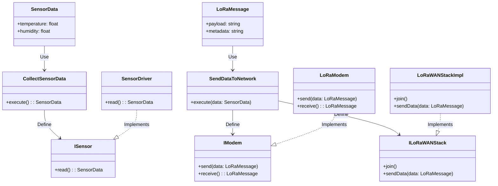

# TEMA 14 - ARQUITECTETURA LIMPIA


## 14.1 Diseño y arquitectura: ¿Son lo mismo?
Diseño y arquitectura son conceptos relacionados pero no idénticos.
Diseño se refiere a las decisiones más específicas sobre cómo se implementan los componentes del software (estructuras de datos, algoritmos, interfaces de usuario).
Arquitectura se ocupa de decisiones de más alto nivel, como la estructura global del sistema, cómo se distribuyen las responsabilidades y cómo interactúan los diferentes módulos. La arquitectura establece las bases y reglas para guiar el diseño del software.

Nota: Robert C. Martin también define arquitectura como "la forma en que se organiza un sistema para que sea fácil de mantener, extender y reutilizar".

## 14.2 Introducción a la arquitectura limpia
La arquitectura limpia fue propuesta por Robert C. Martin (también conocido como Uncle Bob) y se basa en crear software modular, donde los detalles de implementación están separados de las reglas de negocio y lógica del dominio.
El objetivo es evitar la dependencia directa entre componentes del sistema y permitir que cualquier parte del sistema se pueda modificar sin afectar el resto. Este enfoque garantiza que el software sea flexible y mantenible a largo plazo.


## 14.3 Características de la arquitectura limpia
Independencia del marco (framework): El sistema no debe depender de ninguna plataforma específica o tecnología. Los detalles técnicos son periféricos, y el núcleo del sistema permanece agnóstico a las tecnologías específicas.
Testabilidad: La arquitectura debe facilitar la prueba de cada parte del sistema de forma aislada.
Independencia de la interfaz de usuario: La lógica de negocio y las reglas del dominio deben ser independientes de cualquier interfaz de usuario.
Independencia de la base de datos: Las reglas de negocio deben ser independientes de la tecnología o motor de base de datos utilizado.
Independencia de los agentes externos: El sistema debe poder trabajar con o sin agentes externos, tales como servicios web o sistemas operativos específicos.

## 14.4 Partes de la arquitectura limpia
**Capas:** La arquitectura limpia se organiza en capas concéntricas, donde cada capa solo puede depender de las capas internas, no de las externas. Las capas internas manejan las reglas del dominio y de negocio, mientras que las externas manejan los detalles técnicos.  

**Entidades:** Representan los objetos del dominio de negocio, y su lógica central no depende de nada fuera del dominio.

**Casos de uso:** Definen cómo interactúan las entidades para realizar tareas específicas del negocio.
Interfaces y adaptadores: Estas son las partes externas que interactúan con los datos y servicios, pero no contienen lógica del dominio.

**Interface Adapters:** Los adaptadores de interfaz son componentes que se encargan de convertir datos y solicitudes entre los distintos niveles de la arquitectura, facilitando la comunicación entre las capas externas (como la UI o las APIs) y las capas internas (como las entidades y los casos de uso).

**Frameworks & Drivers:** Los frameworks y controladores son las herramientas y tecnologías externas que la aplicación utiliza para interactuar con el mundo exterior. Esto incluye cualquier cosa desde bibliotecas de terceros, frameworks de desarrollo, sistemas de bases de datos, y cualquier otro componente externo que la aplicación pueda utilizar.




## 14.5 Cohesión y acoplamiento de los componentes
**Cohesión:** Se refiere al grado en que las responsabilidades de un módulo o clase están relacionadas. La alta cohesión es deseable, ya que indica que un módulo está centrado en una única tarea o propósito.

| Principio | Descripción                                           | Implicaciones                                           |
|-----------|------------------------------------------------------|--------------------------------------------------------|
| REP (Reuse/Release Equivalence Principle) | Un módulo debe ser liberado o reutilizado como una unidad. | Cambios cohesivos y organizados. Previene el código espagueti. |
| CCP (Common Closure Principle)             | Los componentes que cambian juntos deben ser empaquetados juntos. | Facilita la gestión de cambios y reduce dependencias.  |
| CRP (Common Reuse Principle)                | Los módulos que se utilizan juntos deben ser empaquetados juntos. | Minimiza la confusión y la complejidad en la administración de dependencias. |


**Acoplamiento:** Es la medida en que un módulo depende de otros módulos. La arquitectura limpia promueve el bajo acoplamiento, lo que permite que los módulos sean más independientes y fáciles de modificar sin afectar al resto del sistema.

| Principio                        | Descripción                                                                                         | Implicaciones                                                                               | Ejemplo                                                                                   |
|----------------------------------|-----------------------------------------------------------------------------------------------------|--------------------------------------------------------------------------------------------|-------------------------------------------------------------------------------------------|
| Acyclic Dependencies Principle    | Las dependencias entre módulos deben ser acíclicas.                                               | Facilita el mantenimiento, la reutilización y la comprensión de los módulos.              | Módulos A, B, C donde A → B → C es válido, pero A → C → B (ciclo) no es permitido.     |
| Stable Dependencies Principle      | Un módulo debe depender de otros módulos que son más estables que él mismo.                       | Reduce la fragilidad del sistema y minimiza cambios en módulos dependientes.              | Un módulo de **`UserInterface`** que depende de un módulo **`DatabaseAccess`** estable.  |
| Stable Abstractions Principle      | Un módulo debe ser más abstracto que las clases de las que depende.                               | Promueve la flexibilidad y la extensibilidad del sistema al permitir cambios en implementaciones. | Una interfaz **`PaymentProcessor`** que es más estable que sus implementaciones concretas como **`CreditCardProcessor`**. |


## 14.6 La política y el nivel
En arquitectura limpia, las políticas definen las reglas y comportamientos del dominio de negocio. Estas reglas deben estar en las capas más internas del sistema, protegidas de los detalles técnicos.
El nivel se refiere al lugar que ocupa un componente en la jerarquía de la arquitectura. Los componentes de bajo nivel, como los controladores y las interfaces de usuario, dependen de las políticas de negocio, pero las políticas no deben depender de los detalles técnicos.


## 14.7 Las reglas del negocio
**Reglas de negocio:** Son las reglas que determinan cómo se debe comportar el sistema para cumplir con los requisitos del dominio del problema. Estas reglas están en el corazón de la arquitectura limpia y deben estar completamente desacopladas de los detalles de implementación, como bases de datos o interfaces de usuario.


```cpp
#include <iostream>
#include <vector>
#include <string>

class Appointment {
public:
    int id;
    std::string specialty;
    std::string date;
    std::string time;
    bool isBooked;

    Appointment(int id, const std::string& specialty, const std::string& date, const std::string& time)
        : id(id), specialty(specialty), date(date), time(time), isBooked(false) {}
};

class User {
public:
    int id;
    std::string name;
    std::string paymentMethod;

    User(int id, const std::string& name, const std::string& paymentMethod)
        : id(id), name(name), paymentMethod(paymentMethod) {}
};

class Slot {
public:
    std::string date;
    std::string time;
    bool isAvailable;

    Slot(const std::string& date, const std::string& time)
        : date(date), time(time), isAvailable(true) {}
};

class SelectSpecialty {
public:
    std::string execute(const std::vector<std::string>& specialties) {
        // Simulación: el usuario selecciona la primera especialidad
        return specialties[0];
    }
};

class ViewAvailableSlots {
public:
    std::vector<Slot> execute(const std::string& specialty, const std::vector<Slot>& slots) {
        // Simulación: retorna todos los slots
        return slots;
    }
};

class BookAppointment {
public:
    void execute(Appointment& appointment, User& user) {
        if (!appointment.isBooked) {
            appointment.isBooked = true; // Marca la cita como reservada
            std::cout << "Cita reservada: " << appointment.specialty 
                      << " en " << appointment.date << " a las " << appointment.time 
                      << " para " << user.name << std::endl;
        } else {
            std::cout << "La cita ya está reservada." << std::endl;
        }
    }
};

class PrintTicket {
public:
    void execute(const Appointment& appointment) {
        // Simulación: imprime el ticket
        std::cout << "Imprimiendo ticket..." << std::endl;
        std::cout << "Cita: " << appointment.specialty << " en " << appointment.date 
                  << " a las " << appointment.time << std::endl;
    }
};

int main() {
    std::vector<std::string> specialties = {"Cardiología", "Pediatría", "Dermatología"};
    std::vector<Slot> slots = {
        Slot("2024-10-05", "09:00"),
        Slot("2024-10-05", "10:00"),
        Slot("2024-10-06", "11:00")
    };
    
    User user(1, "Juan Pérez", "Tarjeta de Salud");

    // Seleccionar especialidad
    SelectSpecialty selectSpecialty;
    std::string selectedSpecialty = selectSpecialty.execute(specialties);
    
    // Ver slots disponibles
    ViewAvailableSlots viewSlots;
    auto availableSlots = viewSlots.execute(selectedSpecialty, slots);
    
    // Simular que el usuario selecciona el primer slot
    if (!availableSlots.empty()) {
        Appointment appointment(1, selectedSpecialty, availableSlots[0].date, availableSlots[0].time);
        
        // Reservar la cita
        BookAppointment book;
        book.execute(appointment, user);
        
        // Imprimir el ticket
        PrintTicket print;
        print.execute(appointment);
    } else {
        std::cout << "No hay slots disponibles." << std::endl;
    }

    return 0;
}
```

## 14.8 Los límites y su anatomía
Los límites en arquitectura limpia definen las fronteras entre las diferentes capas y componentes. Estos límites ayudan a evitar que los cambios en una parte del sistema afecten a otras partes.
Anatomía de los límites: Implica definir con claridad qué datos y funcionalidades se exponen a otras capas, asegurando que la lógica del dominio esté protegida de los detalles técnicos.

### Resumen de Tipos de Boundaries en Clean Architecture

### 14.8.1 Monolitos
- **Descripción**: En un enfoque de monolito, todo el sistema se construye como una única unidad. Las diferentes partes de la aplicación se encuentran en un único proyecto.
- **Características**:
  - **Separación de Archivos**: Los boundaries se establecen a través de la organización de los archivos fuente en carpetas o módulos.
  - **Dependencias**: Las partes de la aplicación suelen estar fuertemente acopladas.
- **Ventajas**: Sencillez en la implementación inicial y facilidad de despliegue.
- **Desventajas**: Escalabilidad limitada, dificultad en el mantenimiento y la integración de nuevas tecnologías.

### 14.8.2. Librerías
- **Descripción**: Los componentes de la aplicación se organizan en bibliotecas separadas que pueden ser reutilizadas.
- **Características**:
  - **Modularidad**: Cada biblioteca actúa como un módulo independiente.
  - **Reutilización**: Facilita la reutilización de código entre diferentes aplicaciones.
- **Ventajas**: Mejora la organización del código y facilita el mantenimiento.
- **Desventajas**: Incremento en la complejidad de gestión de dependencias.

### 14.8.3. Procesos Locales
- **Descripción**: Aplicaciones que se ejecutan en la misma máquina y se comunican mediante mecanismos de IPC (comunicación entre procesos).
- **Características**:
  - **Interacción a través de IPC**: Utilizan colas de mensajes, pipes o memoria compartida.
  - **Separación de Ejecución**: Cada proceso se ejecuta de forma independiente.
- **Ventajas**: Aislamiento de fallos y capacidad de escalar procesos de manera independiente.
- **Desventajas**: Complejidad en la gestión de la comunicación entre procesos.

###  14.8.4. Servicios
- **Descripción**: Creación de servicios que se comunican a través de interfaces de red, como APIs REST.
- **Características**:
  - **Desacoplamiento**: Cada servicio puede ser desarrollado y desplegado de forma independiente.
  - **Comunicación a través de la Red**: Interacción mediante protocolos de red.
- **Ventajas**: Alta escalabilidad, flexibilidad en el uso de tecnologías.
- **Desventajas**: Complejidad en la gestión de red y latencias en la comunicación.


## 14.9 Límites parciales y capas
Los límites parciales son aquellos que se encuentran entre los componentes de un sistema, permitiendo una cierta flexibilidad en las interacciones.
Las capas representan las separaciones verticales dentro de la arquitectura, con el propósito de aislar las dependencias entre las diferentes partes del sistema. Cada capa debe ser lo más independiente posible de las otras capas.

### 14.9.1 Saltarse el último paso
Esta técnica consiste en dejar todo preparado para tener un componente independiente (en forma de librería por ejemplo), pero compilarlo conjuntamente con el resto de la aplicación. 
En un futuro, cuando se quiera hacer la separación, el proceso es sencillo.

### 14.9.2 Boundaries unidimensionales
Permiten una solucion intermedia para posteriormente dar el paso a un boundary completo.

[Strategy Pattern](https://refactoring.guru/es/design-patterns/strategy)


```cpp
#include <iostream>

// Interfaz de estrategia
class ISensorStrategy {
public:
    virtual void read() = 0; // Método puro que debe implementarse
    virtual ~ISensorStrategy() = default; // Destructor virtual
};

// Estrategia concreta para sensor de temperatura
class TemperatureSensorStrategy : public ISensorStrategy {
public:
    void read() override {
        std::cout << "Leyendo datos del sensor de temperatura." << std::endl;
        // Aquí iría la lógica para leer la temperatura del sensor
    }
};

// Estrategia concreta para sensor de humedad
class HumiditySensorStrategy : public ISensorStrategy {
public:
    void read() override {
        std::cout << "Leyendo datos del sensor de humedad." << std::endl;
        // Aquí iría la lógica para leer la humedad del sensor
    }
};

// Contexto que utiliza una estrategia de sensor
class SensorContext {
private:
    ISensorStrategy* strategy; // Puntero a la estrategia

public:
    // Establece la estrategia a utilizar
    void setStrategy(ISensorStrategy* newStrategy) {
        strategy = newStrategy; 
    }

    // Llama al método de lectura de la estrategia actual
    void readData() {
        if (strategy) {
            strategy->read();
        } else {
            std::cout << "No hay estrategia establecida." << std::endl;
        }
    }
};

// Función principal
int main() {
    SensorContext context;

    // Usar estrategia de sensor de temperatura
    TemperatureSensorStrategy tempStrategy;
    context.setStrategy(&tempStrategy);
    context.readData(); // Salida: Leyendo datos del sensor de temperatura.

    // Usar estrategia de sensor de humedad
    HumiditySensorStrategy humidityStrategy;
    context.setStrategy(&humidityStrategy);
    context.readData(); // Salida: Leyendo datos del sensor de humedad.

    return 0;
}
```

### 14.9.3 Patron facade
El patron facade nos permite crear una abstración mínima para aislar una funcionalidad partcial de una librería o framework mayor.

[Facade pattern](https://refactoring.guru/es/design-patterns/facade)

```cpp
#include <opencv2/opencv.hpp>
#include <iostream>

class ImageProcessorFacade {
public:
    // Método para mostrar la imagen
    void showImage(const std::string& filePath) {
        cv::Mat image = loadImage(filePath);
        if (image.empty()) {
            return; // Salir si la imagen no se carga
        }

        cv::Mat grayImage = convertToGray(image);
        displayImage("Imagen en Escala de Grises", grayImage);
    }

private:
    // Carga una imagen desde un archivo
    cv::Mat loadImage(const std::string& filePath) {
        cv::Mat image = cv::imread(filePath);
        if (image.empty()) {
            std::cerr << "Error: Could not load image at " << filePath << std::endl;
        }
        return image;
    }

    // Convierte la imagen a escala de grises
    cv::Mat convertToGray(const cv::Mat& image) {
        cv::Mat grayImage;
        cv::cvtColor(image, grayImage, cv::COLOR_BGR2GRAY);
        return grayImage;
    }

    // Muestra la imagen en una ventana
    void displayImage(const std::string& windowName, const cv::Mat& image) {
        cv::imshow(windowName, image);
        cv::waitKey(0); // Espera hasta que se presione una tecla
        cv::destroyAllWindows(); // Cierra la ventana
    }
};
```

## 14.10 Servicios pequeños y grandes
La arquitectura limpia puede implementarse tanto en sistemas de microservicios como en sistemas monolíticos. Los servicios pequeños son unidades discretas que cumplen con una única responsabilidad, mientras que los servicios grandes agrupan varias funcionalidades, pero deben seguir respetando los principios de la arquitectura limpia.

Conclusion: La arquitectura está definida por los boundaries del sistema y las dependencias que los cruzan. No por la naturaleza de los componentes (servicios, procesos o librerías).

## 14.11 Preparación de un proyecto enfocado a la arquitectura limpia
Al iniciar un proyecto con enfoque en arquitectura limpia, es importante definir desde el principio las capas del sistema y las reglas de negocio. Es esencial diseñar el sistema de manera modular, asegurando que los detalles de implementación no estén acoplados a la lógica central del sistema.

Una buena arquitectura se centra en los casos de uso de forma que los arquitectos puedan describir de forma segura las estructuras que soportan esos casos sin comprometerse con frameworks, herramientas o entornos especificos.

Truco: Una buena arquitectura debería permitir elegir frameworks y otros componentes de terceros en fases posteriores, e incluso cambiar alguno de ellos sin problemas.

## 14.12 Introducción a las pruebas unitarias e integración
Las pruebas unitarias se enfocan en probar pequeñas partes del sistema (como clases o funciones) de manera aislada, mientras que las pruebas de integración prueban cómo interactúan esas partes entre sí.
La arquitectura limpia facilita las pruebas unitarias porque promueve la separación de preocupaciones, lo que permite que las diferentes partes del sistema sean probadas de manera aislada.

| **Característica**          | **Mock**                                                                 | **Stub**                                                              | **Fake**                                                                     |
|-----------------------------|-------------------------------------------------------------------------|-----------------------------------------------------------------------|-------------------------------------------------------------------------------|
| **Propósito**               | Simular el comportamiento de un objeto y verificar interacciones.        | Proporcionar valores predefinidos en lugar de un componente real.     | Implementación funcional simplificada de un componente real.                  |
| **Comportamiento**           | Valida la interacción con el objeto simulado (verifica que se llamen los métodos correctos). | Proporciona respuestas específicas para pruebas, pero no verifica interacción. | Realiza una implementación completa pero simplificada, rápida y apta para pruebas. |
| **Uso común**               | Verificar si se llaman los métodos esperados con los argumentos correctos. | Cuando solo se necesita devolver datos predefinidos sin lógica adicional. | Reemplazar componentes externos más complejos, como bases de datos o servicios. |
| **Implementación**          | Definen expectativas de cómo deberían ser usadas (número de llamadas, argumentos). | Devuelve respuestas fijas, generalmente sin lógica adicional.         | Implementación funcional de bajo costo, pero no necesariamente igual de compleja que la real. |
| **Ejemplo**                 | Simular una API de envío de correos y verificar que se envía un correo con los datos correctos. | Un método que siempre devuelve un valor fijo (como una constante o un valor preconfigurado). | Un sistema de base de datos en memoria que almacena y devuelve datos pero no con todas las funcionalidades de una base de datos real. |
| **Verificación**            | Realiza verificaciones automáticas sobre cómo se usó el mock (número de llamadas, parámetros, etc.). | No realiza ninguna verificación sobre cómo se usa el stub.            | No realiza verificación de uso, pero puede tener comportamiento suficiente para pruebas. |
| **Complejidad**             | Alta, debido a la necesidad de programar las expectativas y verificar interacciones. | Baja, ya que solo necesita proporcionar datos fijos para las pruebas. | Moderada, es una implementación simplificada, pero funcional.                |
| **Cuando Usar**             | Cuando es importante verificar cómo interactúan los objetos entre sí.    | Cuando solo se necesita devolver datos específicos para que avance la prueba. | Cuando se necesita una implementación funcional que imita al sistema real, pero más sencilla. |
| **Ejemplo de Framework**    | `GoogleMock`, `Mockito`                                                  | Manual o usando un framework de mocking con respuestas predefinidas.  | Implementación a mano o con frameworks como `SQLite` (como una base de datos fake). |


## 14.13 La importancia del testing en un proyecto
El testing es vital para garantizar que el sistema funcione correctamente a medida que evoluciona. Las pruebas automatizadas permiten detectar errores de forma temprana, mejorando la calidad del software y reduciendo el tiempo de depuración.

```c
#include <stdio.h>

// Variable estática global, accesible solo dentro de este archivo
static int globalCounter = 0; // Contador de llamadas a la función

// Función que incrementa y devuelve el contador
int incrementCounter() {
    globalCounter++;
    return globalCounter; // Devuelve el valor del contador
}

// Función principal para probar el código
int main() {
    printf("Llamada 1: %d\n", incrementCounter()); // Debería imprimir 1
    printf("Llamada 2: %d\n", incrementCounter()); // Debería imprimir 2
    printf("Llamada 3: %d\n", incrementCounter()); // Debería imprimir 3

    return 0;
}
```


## 14.14 Configuración y redacción de pruebas unitarias
Configurar y redactar pruebas unitarias implica diseñar pruebas que cubran todas las rutas críticas del código. Deben ser fáciles de leer, rápidas de ejecutar y cubrir tanto casos positivos como negativos.

## 14.14.1 Corner Cases
Las funciones o metodos suelen tener una serie de rangos en los que su funcionamiento es identico y entre esos rangos, hay algunos valores críticos (corner cases).
Cada uno de los rangos puede probarse con un solo valor dentro del mismo. Pero los corner cases deben probarse en su totalidad. Puesto que son los puntos mas debiles de tu función.

## 14.15 Recomendaciones profesionales para la automatización de ejecución de pruebas unitarias y de integración
Las recomendaciones profesionales incluyen la automatización de las pruebas unitarias e integradas dentro del pipeline de CI/CD (Integración Continua y Despliegue Continuo), lo que garantiza que cada cambio en el código sea probado automáticamente antes de ser integrado al sistema principal.

## 14.15.1 Poner en marcha tu CI/CD
Antes de automatizar pruebas, hay que tener una CI básica que compile el código y nos indique si hay errores. Posteriormente, añadir un nuevo "step" en el pipeline para ejecutar los tests es sencillo.

Los datos de tests ejecutados y cobertura pueden exportarse a una herramienta externa como SonarQube para tener un dashboard interactivo.

## 14.16 Conclusión y buenas prácticas
Conclusión: La arquitectura limpia ofrece una forma estructurada y efectiva de organizar sistemas complejos, proporcionando independencia de los detalles técnicos y facilitando la evolución del sistema a lo largo del tiempo.
Buenas prácticas incluyen mantener alta cohesión y bajo acoplamiento, respetar los principios de diseño modular, y realizar pruebas automatizadas para asegurar que el sistema sea robusto y escalable.
La arquitectura limpia es esencial para el desarrollo de software mantenible y adaptable a largo plazo. Aplicar estos principios de manera rigurosa asegura que los sistemas sean robustos, flexibles y capaces de evolucionar sin problemas.

